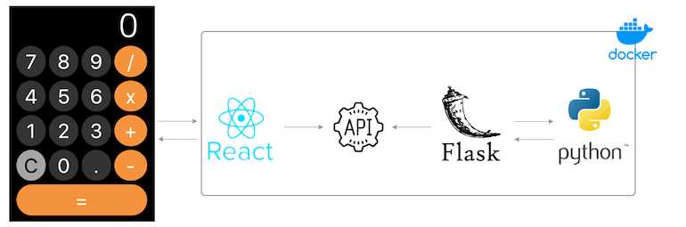

# Calculator

Full-stack project that tries to show different concepts of backend in Python/Flask and frontend with JavaScript/React to build a simple calculator.



## Features:

 * CLI interface
 * Basic API
 * React Fronted
 * Unittests
 * Dockerfile


 ## Requirements

 * Python3
 * GNU Make
 * Nodejs
 * Yarn 
 * Docker (optional)

## Getting started

To see in action open http://calculator.rivera.pro

To get it running locally with Docker:

```
$ docker pull erikriver/calculator:latest
$ docker run -it -p 5000:5000 erikriver/calculator:latest
```

If you prefer get it running locally run the following after cloning the repository:

```
$ make all
```

and open in your web browser the url http://localhost:5000/ or you can run it by steps:

```
$ make backend       # Install and configure a Python virtual environment with their packages
$ make frontend      # Install and build the React frontend
$ make run           # run the project
```

## Plus

There is an CLI calculator to evaluate expressions as an argument, you follow this steps in the root of the repository to try it:

```
$ make backend
$ source venv/bin/activate
$ cd backend/
$ python app.py --expr 22+45-3
```

or

```
$  python app.py
Arithmetic expression:

```

* The expresions have four operators `+`, `-`, `/`, `x`
* You can run multiple operations in the same expresion: `42/34x5-12`
* it doesn't matter if it contains spaces between operations `2.5 + 2.7`, `4x .3 -5.0`
* Catch exceptions if the expression is malformed `3/2x+3`, `45.3-7.1+`
* You can use float numbers like `.12` or `0.12`, i. e. `.56 - 0.23`
